+++
title = "ShinySpider"
date = "2026-01-05"
draft = false
tags = ["malware", "windows"]
+++
# ShinySpider

Well, this is my first blog post in this, and we're gonna look at a malware analysis challenge from the website [mallops](https://malops.io/).

Rather than providing the answers to the questions in the website, I shall just show how I approached the challenge(Taking the direction of the questions). I am not experienced with windows malwares, so I shall be learning as I go through the challenge.

Alright, lets get started!

## Question 1: `Which version of the Go compiler was used to build this binary?`

Alright, so a `go` compiled binary, nothing that I haven't seen before. Alright lets just run `strings` on the binary to see if we find anything useful. A whole lotta strings, this is due to the fact that go binaries are statically linked so the binaries dont have any runtime dependecies, and the system does not require any loaders. Other than that stuff like Go runtime, std lib parts, metadata and debug info are also present in the binary. Due to this even small binaries have very large sizes.

A simple google search with the question in mind provides us with this:
`strings $(which go-bindata) | grep go1`, and we get the answer to our first question.

## Question 2: `What is the Relative Virtual Address (RVA) of the program's main function?`

Now we're getting into the proper RE part of this challenge. We'll be using `IDA Pro` for this.

Opening the binary, we instantly see that its a stripped binary, and we do not have any symbols for it.Now we have more tools/scripts for IDA which an be used to recover a lot of the symbols(which we will look into later). Currently we're gonna just see how to solve this normally without using external scripts.

Now since uses its own scheduler, its startup is quite distinct from `C/C++` startups. Your actual main is `main.main`, Before this is executed there is an Initialization routine which happens(This is pretty much the same for almost all Go binaries). This can be classified into 5 steps.

> Note: One easy step that you can do is to compile a simple go binary to compare the unstripped go routines with the stripped ones. 

### Phase 1
### Hardware Handshake(`_start -> rt0_go`)
1) CPUID check: Verifies process model(Intel/AMD) to ensure it supports necessary instructions, In the program you can see this:
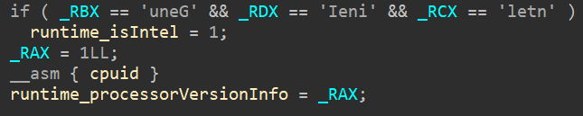
> *translates to "GenuineIntel"*

2. TLS: It sets up all the registers required for threading
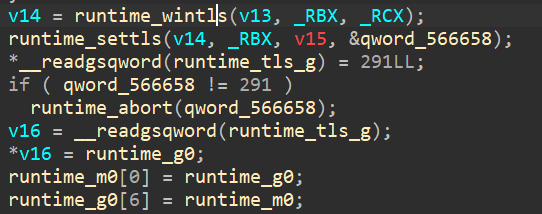

### Phase 2
### Bootstrapping the Runtime
* `runtime_check_0` - This is for checking/verifying the sizes of types.
* `runtime_args_0` - In this the `argv` and `argc` passed to the binary, from the OS memory to the go memory.
* `runtime_osinit_0` - Gets information about the system like the no. of logical processors, page sizes etc.
* `runtime_schedinit_0` - Sets up the memory allocator and the garbage collector.

### Phase 3
### Creation
* `runtime_newproc_0` - creates the main goroutine. One of the arguments being passed into this points to the `runtime_main`, so basically this is telling the scheduler to create a thread that is to run the `runtime_main` function. Now this goroutine is just put in the ready queue, It has not started running yet.

### Phase 4
### Execution
`runtime_mstart` - Our thread which was in the ready queue, is now made a worker and starts executing

### Phase 5
### main function call
Now we move to the `runtime_main` function, here, I wont be explaining what everything is doing in the context of things as its not our current obective(although I side tracked a lot just before this), but just keep in mind that our `main_main` function call is only around the end of the function, the stuff above is a lot of intialization. 
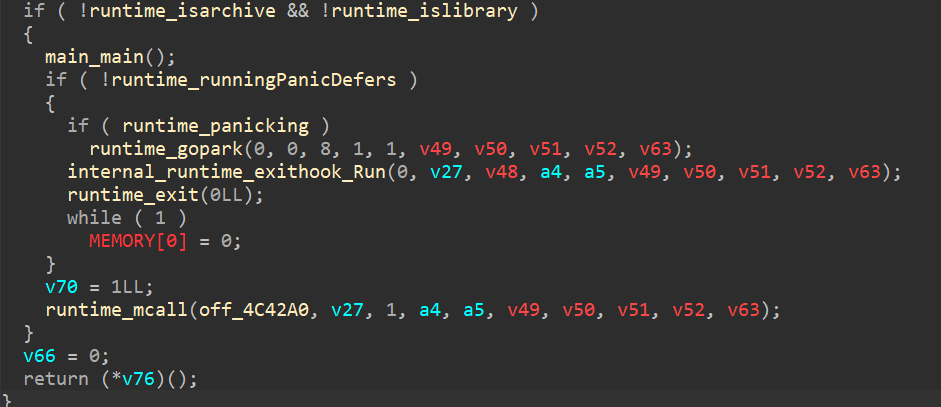

Althogh this is the unstripped binary, since the routine is similar, we just need to look for the same pattern in the provided malware to find out the location of the our `main_main`.

All of this is not really necessary to understand to solve the challenge right now, you can always use tools to fix all of this instead of wasting a lot of time.

The tool `GoReSym` is what I used. It helps...(somewhat...Im not sure)

## Question 3: `In the isRunningAsAdmin function, which Windows API is the first to be resolved via the HCWin/apihash package?`

Searching for `isRunningAsAdmin` we get this function `main_isRunningAsAdmin`, where in there is a function call which we know is the solution for that question. So, what is `API hashing`?

Basically you can't really have direct calls for api's if you're tryning to make a malware, cause tools exist to statically check the api's being called, so instead of that, we hash each api of specific libraries and go iteratively(can be however the malware author wants) and get the bytes, compare the hash of bytes of that function with the hash that is provided, if they match, that particular API is called.

Alright now when you check inside the function you can directly see the function `HCWin_apihash___APIHash__GetCurrentProcess` being called, checking inside it you can see this:
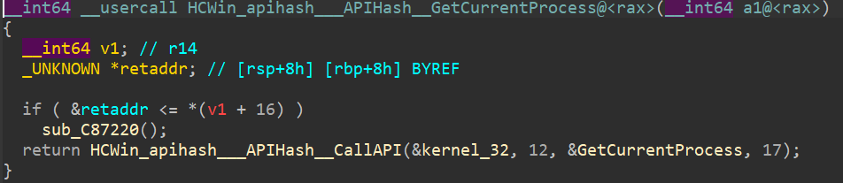
so the first hash to be resolved inside the isAdminFunction is: `kernel32.dll.GetCurrentProcess`

## Question 4: `The binary calls GetTokenInformation. What specific token class (by name) is being requested to verify privileges?`

Well for this one, I tried going though it from top to bottm, but it was taking a lot of time. So I went for a CTF styled approach, which was to search for the string(bytes) in IDA. 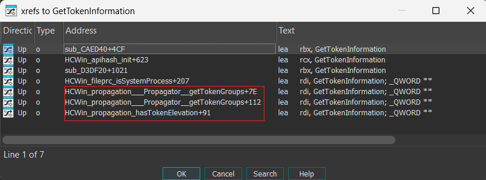
And according to the question, the last function *sounds* the most propable approach. So i'm gonna go with that. Yes half the fun of solving challenges.

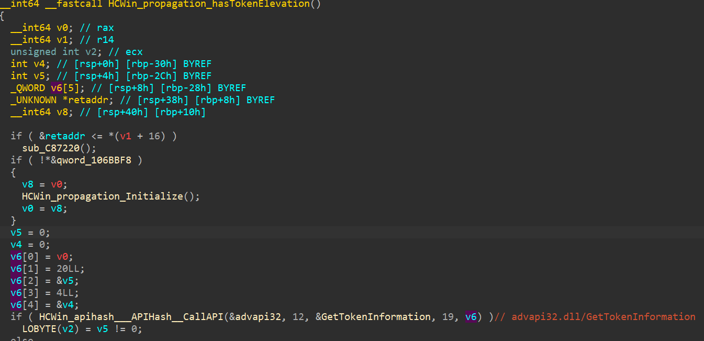

Checking the arguments for the [API call](https://learn.microsoft.com/en-us/windows/win32/api/securitybaseapi/nf-securitybaseapi-gettokeninformation) we see that the value for `TOKEN_INFORMATION_CLASS ` is `20` and there the name for that is the correct one.


## Question 5: `Which package is responsible for configuring and executing the evasion of Event Tracing for Windows?`

Alright so looking through `main.main` you can see the occurance of the function `HCWin_etwevasion___ETWEvader__Enable`, The question just asks for the package, so its pretty evident from the name itself what those are. 

## Question 6: `If the malware fails to retrieve the computer name via the Windows API, which environment variable does it read as a fallback to generate the system seed?`

Well time to go CTF mode again and search for the keyword `seed` you see the function `main_getSystemSeed` which is being called by `main_generateMutexName` which makes sense according to the question. 
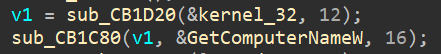 
Now after checking through the function we can see in the else condition, the arguments being passed is:
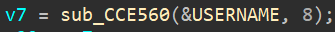
which is "USERNAME", which seems to be the most propable cause it supposed to be the alternate for when `GetComputerNameW` fails. And its the correct one....
 
I guess half of being good at ctfs is being good at gambling.

## Question 7: `The function getSystemSeed dynamically loads a DLL to access GetComputerNameW. What is the name of this DLL?`

This one gets solved by the time we went through the previous function

## Question 8: `The malware prepends a specific string to the generated Mutex name to ensure the synchronization object is visible across all user sessions. What is this prefix?`

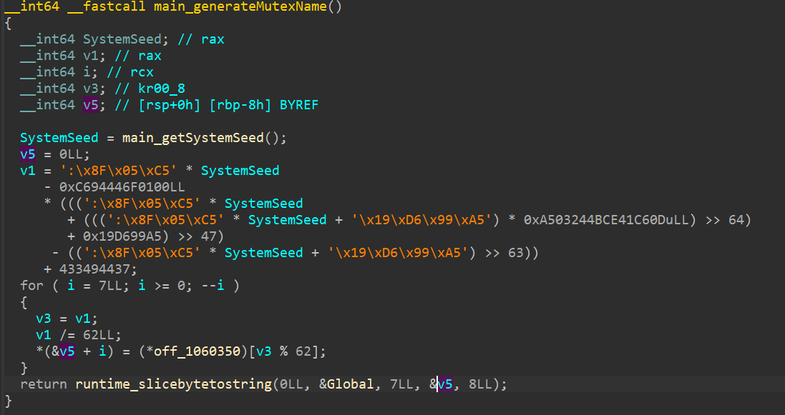
We can see the `runtime_slicebytestostring` function, and its appending `Global/` at the front of the generated mutex name.

After that, it calls the function `main_checkSingleInstance` where it resolves and calls the API `CreateMutexW` 

If I had to explain what these could be used for, I could do it like this(this could be wrong but I shall try to the best of my ability)

Usually malwares run based on certain triggers, such as when a user logs into the system or when a certain application is opened so on and so forth, the issues with this is that when each time this is called if a new instace of the malware is spawned it can be suspecious. Or if each instace of the malware takes a lot of resources imagine if there were like 10 or 50 instances of it. So basically after the first instance of the malware runs, when the 2nd one(or more) runs they do:

and kill themselves.

## Question 9: `Which specific Windows error code does the checkSingleInstance function check to see if the Mutex already exists?`

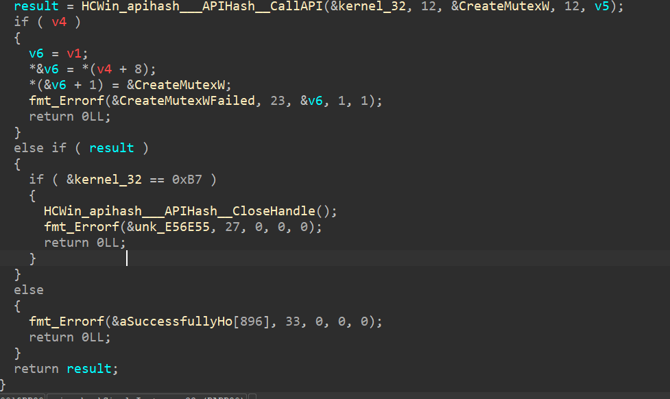
Hmmm I wonder which one it could be. 
`0xB7` stands for `ERROR_ALREADY_EXISTS` so it knows that another instance is running so it can kill itself.

Another issue with multiple isntances I suppose is that, if its something like a ransomware multiple instances can encrypt the same files again and again.


## Question 10: `The Hook Shield module starts a monitoring routine to check for hooks periodically. What is the time interval (in milliseconds) defined in this check?`

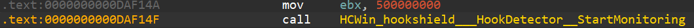

we can see the value `500000000` being passed as the second argument for this function. 
I mean the second I saw that, i already tried `500ms` as the answer which worked...

But aside from that, I wanted to try and figure out how its being done. 
`mov     [rsp+48h+arg_8], rbx`
`mov rcx, [rsp+48h+arg_8]`
`mov     [rax+10h], rcx`
`call    runtime_newproc`

and 

```
lea     rcx, HCWin_hookshield___HookDetector__StartMonitoring_gowrap2
mov     [rax], rcx
mov     rcx, [rsp+48h+arg_0]
mov     [rax+8], rcx
mov     rcx, [rsp+48h+arg_8]
mov     [rax+10h], rcx
call    runtime_newproc
```
and checking through the gowrap2 we see that the `HCWin_hookshield___HookDetector__monitoringLoop` is called. Inisde that the function `sub_CBBC80` is also called which has `runtime_netpoll`, `time_when` and inside the `HCWin_hookshield___HookDetector__monitoringLoop_deferwrap1` we can see `time_stopTimer`
which makes it clear that this is the function that deals with the time/polling.

## Question 11: `To prevent victims from restoring files, the malware executes a specific function to remove Windows Volume Shadow Copies. What is the name of this function?`

Hmmm I wonder where the functions could be...
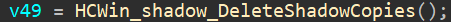

##Question 12: `How many distinct services or processes is the malware configured to terminate (kill)?`

I found the logic to be in `main_killBlacklistedServices` function, you can see the first for loop, which is using the value from the address for no of iterations. 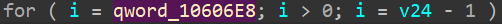

## Question 13: `What is the memory address of the string data for the first service in the kill list?`

```
mov     rax, cs:off_10606E0
mov     rcx, [rax]
[rsp+240h+var_1C8], rcx
rcx, [rsp+240h+var_1C8]
call    runtime_mapassign_faststr
```

This is the flow of the applications that are to be killed. So we just need to check the first address of the string name of the process and this question is down.

## Question 14: `The malware uses multiple methods to propagate to other systems. According to the string at 0xe4c09d, what is the first protocol it attempts to use for remote execution?`

I mean, the location is provided anyways, so.. yes.

### Question 15 : `To identify vulnerable file shares for lateral movement, the malware checks for a specific open port number. What is this port?`

Intially the solve for this came by just searching for the name `Port` in the IDA functions. 
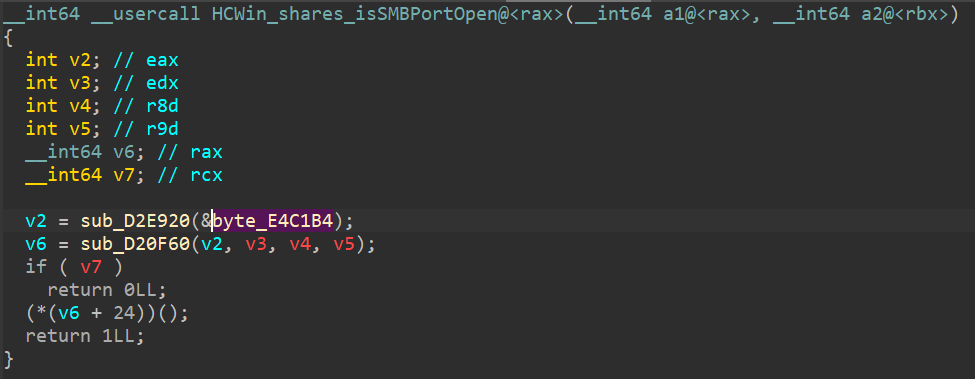
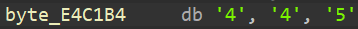


But lets just see the flow from main, until we reached here. it starts from `main_main_func1` to `main_encryptNetworkShares` to `HCWin_shares_DiscoverNetworkHosts_func1` routine  to `HCWin_shares_scanIPRange` to `HCWin_shares_scanIPRange` routine to `HCWin_shares_isSMBPortOpen`.

Here the port `445` is targeted cause thats the  SMB (Server Message Block) which is what windows uses for file sharing. The malware basically probles every IP in the local subnet for TCP port 445(`SMB`). Instead of trying to infect spend a lot of time trying to infect all the devices, which creates a lot of noise and also takes a lot of time, It checks for all devices with an open `445` port and starts encrypting the files.


## Question 16: `The malware contains a hardcoded list of files to skip to ensure the OS remains bootable. Which hidden system directory related to deleted files is explicitly excluded?`

For this one, I remmember while going through the `main_encryptNetworkShares_func2` function, seeing the `main_findFiles_func1` which by chance had the "Skip %s..." string. So I went back to it.
Inside the else case there were 3 typesof files/folders to skip or to accept. 
1) certain directories - `0x00000000010664A0`
2) Certain file names - `00000000010606A0`
3) Certain extentions(this is what all allowed ig) - `00000000010606C0` 

inside this the first one for the directories section is the answer to our question.

## Question 17: `To avoid encrypting its own instructions, the malware excludes a specific filename from the encryption list. What is the name of this note file?`

This one actually took a bit of time, cause I missed that function while cleaning up the code. 

but yes, its there in the same function in this section.
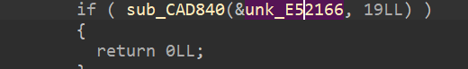
which holds our file name. 

## Question 18: `The malware uses a checksum algorithm to identify files it has already encrypted. What is the expected total length (including the dot) of the extension validated in 'isValidExtension'?`

Honestly speaking, I just guessed this one cause it was a single digit number.
But let us

check the function `isValidExtension` anyways to see whats up

hmmm....
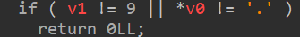

But from what I see(I used llm cause too many numbers), it basically doing a base62 character validation and then doing checksum loop. This function is called again in `main_encryptFile`.

## Question 19: `The malware generates a random symmetric key for each file. Based on the buffer size passed to crypto/rand.Read, what is the bit length of this key?`

`main_encryptFile` function is what we're gonna look into, I realize that I could've had an easier time if I analyzed this function for the last 2 questions.

But inside the function I see the function `sub_CFB8C0` which I thought was a little bit suspecious as the number `32` was being passed as argument(hunch), from there when I checked through the strings of the error messages I see this "rand.Read failed:...."so I guess this is the function that we want to deal with.

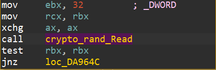
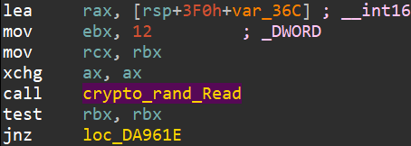
This is the Key and IV for the encryption.

## Question 20: `To secure the per-file symmetric keys, the malware encrypts them using a public key algorithm. Which specific padding scheme is used with RSA?`

I lowkey just googled rsa padding schemes and tried to match the `****` for this. But lets just see whats up, right after the key and the IV is created, there is a function call and after the `main_loadRSAPublicKeyFromModulus` is called, we see a function with quite a number of arguments being passed to it(in this screenshot ive renamed it)
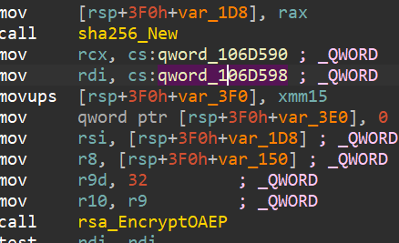
Looking through the function briefly I see the function `crypto_internal_fips140_rsa_EncryptOAEP` around the end of the function, which I guess is how you're supposed to find the solution for this question.

## Question 21: `The malware creates a header for encrypted files. What 4-byte ASCII string (Magic Marker) is written at the very end of the file header?`

Just by simply going through the function you get to see these
```
mov     [rsp+3F0h+var_370], 'RDPS'
mov     [rsp+3F0h+var_374], 'SDNE'
....
lea     rbx, [rsp+3F0h+var_374]
mov     ecx, 4
mov     rdi, rcx
call    bufio_Reader_Read
```
This happens to both RDPS and SDNE, which seems to be like the starting and the ending magic bytes

## Question 22: `For large files, the malware does not encrypt the entire content to save time. What single character does it write to the file footer to indicate this mode?`

So for this, they're doing 2 types of modes for it indicated by `P` - `partial` `C` - `automatic`, This gets written to the footer using `bufio_Writer_WriteByte` after the header fields are serialized.

This is done for files above the size of 500mb as shown in this command
`cmp     rbx, 1F400000h`

## Question 23: `The malware uses a specific Windows API function from user32.dll to apply the new wallpaper. What is the name of this function?`

Searching for the keyword "wallpaper" in the IDA functions, we get to see the function, `main_changeWallpaper` which has a `HCWin_apihash___APIHash__CallAPI` in direct view with `user32.dll` and `SystemParametersInfoW` as arguments.  

## Question 24: `The malware uses above mentioned API to change the desktop wallpaper. What specific SPI constant (by name) is passed as the 'uiAction' argument to trigger this behavior?`

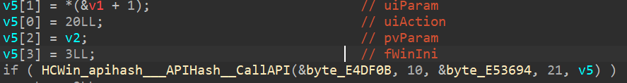

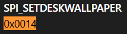
<details><summary> This is how the wallpaper looks like </summary>

   

 I lied, I dont know
</details>

## Question 25: `n the fallback self-destruct mechanism, the malware drops a VBScript to disk. Which Windows executable is explicitly invoked to run this script silently?`

`main_selfDestruct` - this might be the function. perchance. Inside this function another function `main_deleteSelfViaWMI` is being called.
Here we can see that a VBScript is dropped to disk(`cleanup.Vbs`). The function calls the Sprintf with a hardcoded template
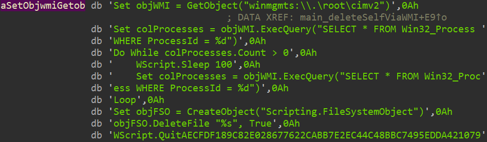
Now this format takes %d - for the malware's pid and which is called from `kernel_32/GetCurrentProcessId` and a %s to delete the malware binary itself by taking its path(One of the arguments for this function).
`sub_CD0360` is a file write(file name and permissions being written to it)

`wscript.exe //B //Nologo "%s"` is the execution command, `//B` supresses all command errors and `//Nologo:` Prevents the WScript banner from displaying. 

## Question 26: `Who is the person standing right behind you?`

Yay, thats the end of the challenge, I am now going to sleep, bye bye


